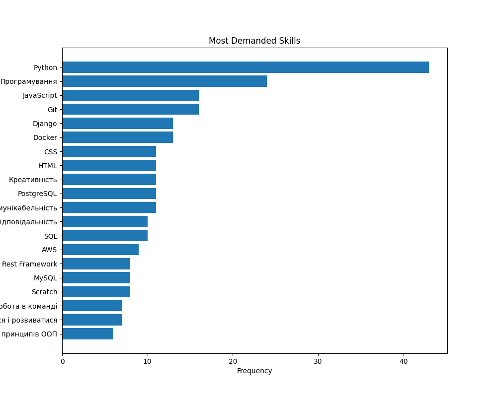
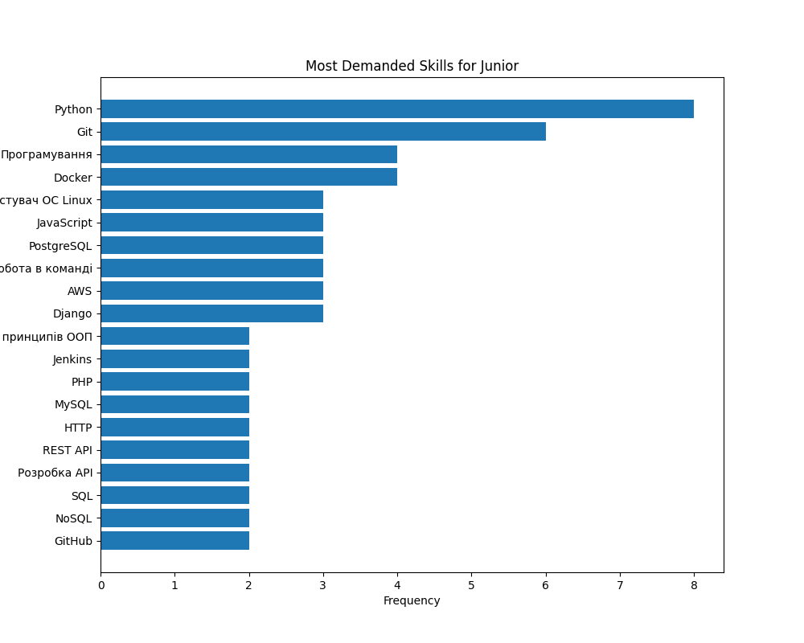
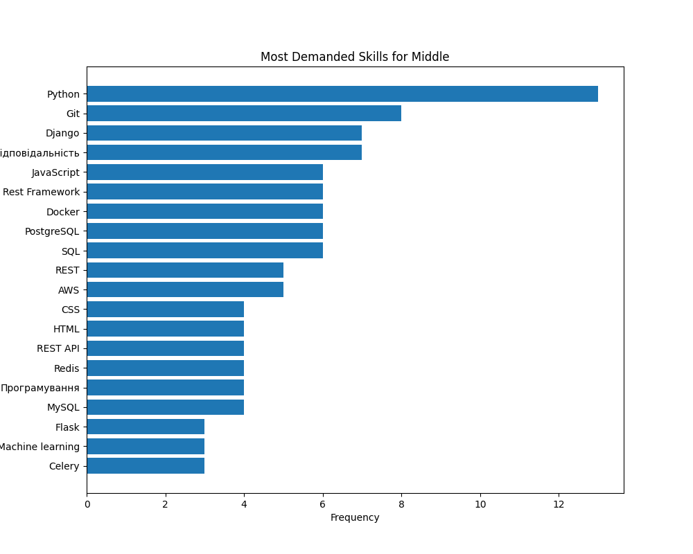
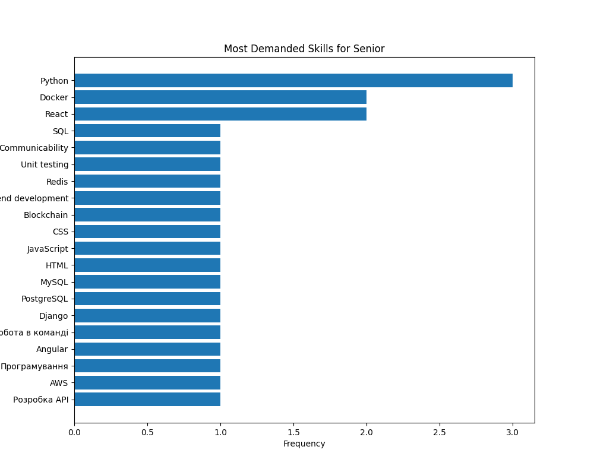

# Job Skill Analyzer

Job Skill Analyzer is a Python-based project that scrapes job listings from Work.ua and analyzes the skills required for these jobs. The project leverages web scraping techniques to collect job data and performs data analysis to provide insights into the most demanded skills in the job market.

## Features

- Scrape job listings from Work.ua
- Extract job titles, descriptions, required experience, and skills
- Analyze and visualize the most demanded skills for different job levels (Junior, Middle, Senior)

## Project Structure

- `main.py`: Main entry point to run scraping and analysis.
- `web_scraping.py`: Contains the scraping logic.
- `data_analysis.py`: Contains the data analysis logic.
- `config.py`: Configuration file for base URL and other settings.
- `requirements.txt`: List of dependencies.

## Setup

1. Clone the repository:
   ```sh
   git clone https://github.com/March1205/job-skill-analyzer.git
   cd job-skill-analyzer
   ```

2. Create and activate a virtual environment:
    ```sh
    python -m venv .venv
    source .venv/bin/activate
    ```
   On Windows use: 
   ```sh
   .venv\Scripts\activate
   ```

3. Install dependencies:
    ```sh
    pip install -r requirements.txt
    ```

4. Run the scraper and analyzer::
    ```sh
    python main.py --scrape --analyze
    ```
## Example Output
- **Overall Most Demanded Skills**



- **Most Demanded Skills for Junior Level**



- **Most Demanded Skills for Middle Level**



- **Most Demanded Skills for Senior Level**


